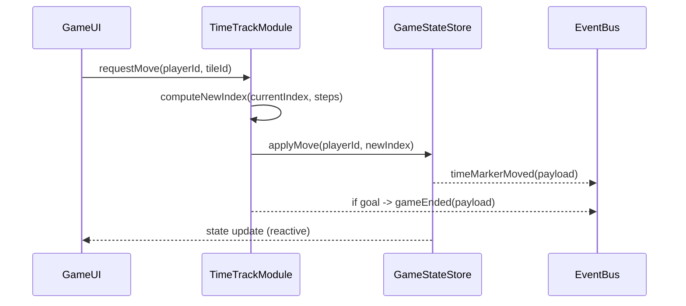

# Design: time-marker-move-2

## Overview

この設計は、`time-marker-move-2` 要件（8×8 トラック上のタイムマーカー移動、ゴール `(4,3)` 到達でゲーム終了）を実装するためのアーキテクチャとインターフェースを定義する。実装は TypeScript / React の既存スタックに沿って行う。

### Goals

- 要件 1–5 を満たす安全でテスト可能な `TimeTrack` モジュールを提供する。
- UI と状態ストアの一貫性を保ちつつ、ゴール到達でゲーム終了処理を行う。
- 明確なインターフェースでユニット・統合テストを容易にする。

### Non-Goals

- マルチプレイヤー同期やサーバサイド永続化はこの設計の範囲外とする。

## Architecture

### Existing Architecture Analysis

- 本プロジェクトはフロントエンド中心で、ドメインモデルを `src/models/`、状態を `src/state/` に置く方針（steering に従う）。本機能はフロントエンド内で完結し、外部 API を追加しない。

### Architecture Pattern & Boundary Map

- Selected pattern: Modular Domain Module — `TimeTrack` を独立したサービスモジュールとして実装し、`GameStateStore` とイベントで連携する。



## Technology Stack & Alignment

| Layer    | Choice / Version                     | Role                            |
| -------- | ------------------------------------ | ------------------------------- |
| Frontend | React + TypeScript                   | UI and domain logic             |
| State    | existing in-memory store (src/state) | GameState persistence in memory |
| Testing  | Vitest + @testing-library/react      | Unit & integration tests        |

## Requirements Traceability

| Requirement | Summary                 | Components                                | Interfaces                 | Flows      |
| ----------- | ----------------------- | ----------------------------------------- | -------------------------- | ---------- |
| 1.1         | パッチタイル選択で移動  | TimeTrackModule                           | computeNewIndex, applyMove | sequence   |
| 1.2         | 決定論的計算            | TimeTrackModule                           | computeNewIndex            | sequence   |
| 1.3         | 無効値拒否              | TimeTrackModule                           | validateMove               | sequence   |
| 2.1         | UI は利用可能タイルのみ | GameUI                                    | TileSelector props         | UI flow    |
| 2.2         | 無効選択の拒否表示      | GameUI, GameLogic                         | selectionResult error      | UI flow    |
| 3.1-3.4     | ゴール到達で終了        | TimeTrackModule, GameStateStore, EventBus | applyMove, gameEnded event | sequence   |
| 4.1-4.3     | 状態/イベント更新       | GameStateStore, EventBus                  | applyMove, timeMarkerMoved | sequence   |
| 5.1-5.3     | 再現可能な API とテスト | TimeTrackModule                           | computeNewIndex            | unit tests |

## Components and Interfaces

### TimeTrackModule (Domain Service)

| Field        | Detail                                                       |
| ------------ | ------------------------------------------------------------ |
| Intent       | タイムトラック上の移動ロジックとゴール判定を提供するサービス |
| Requirements | 1.1,1.2,1.3,3._,5._                                          |

Responsibilities & Constraints

- 純粋関数 `computeNewIndex(currentIndex, steps): number` を提供し、状態を変更しない（1.2,5.1）。
- 状態変更を行う `applyMove(playerId, steps): MoveResult` は GameStateStore を通じて原子更新を行う。

Dependencies

- Inbound: UI の `requestMove` 呼び出し（P0）
- Outbound: `GameStateStore.applyMove`（P0）、`EventBus.publish`（P1）

Contracts

##### Service Interface (TypeScript)

```typescript
type PlayerId = string;
type Index = number; // 0..63 linear index

interface TimeTrackService {
  computeNewIndex(currentIndex: Index, steps: number): Index;
  applyMove(playerId: PlayerId, steps: number): Promise<MoveResult>;
}

interface MoveResult {
  playerId: PlayerId;
  previousIndex: Index;
  stepsMoved: number;
  resultingIndex: Index;
  goalReached: boolean;
}
```

Preconditions:

- `currentIndex` は 0..63 の範囲であること。
- `steps` は整数で、負の値は無効とする。

Postconditions:

- `applyMove` は成功時に `MoveResult` を返し、内部で `GameStateStore` を原子更新し `timeMarkerMoved` イベントを発行する。

### GameStateStore (既存ストア拡張)

| Intent | インメモリのゲーム状態を保持し、原子操作でマーカー位置を更新する |
| Requirements | 4.1,4.2 |

Interface (概略)

```typescript
interface GameStateStore {
  getPlayerIndex(playerId: PlayerId): Index;
  applyMove(playerId: PlayerId, newIndex: Index): void; // 原子更新
  setGameEnded(reason: string): void;
}
```

### Game UI — TileSelector (UI コンポーネント)

| Intent | プレイヤーがパッチタイルを選択するインターフェースを提供 |
| Requirements | 2.1,2.2 |

Props Contract

```typescript
interface TileSelectorProps {
  availableTileIds: string[];
  onSelect(tileId: string): void; // 呼び出しは requestMove をトリガー
}
```

Behavior Notes

- UI は `availableTileIds` にない選択をブロックし、不正選択時にエラー表示を行う。

### Event Contracts

- `timeMarkerMoved` (published when move applied)
  - payload: `{ playerId, previousIndex, stepsMoved, resultingIndex }`
- `gameEnded` (published when goal reached)
  - payload: `{ winnerPlayerId?, reason: 'goal-reached', finalIndex }`

## System Flows

- シンプルなシーケンス図（上部参照）に従い、UI→TimeTrack→Store→Event の流れで完結する。

## Data Models

- `TimeMarker` 型

```typescript
interface TimeMarker {
  playerId: PlayerId;
  index: Index; // 0..63
}
```

Index ↔ (row,col) マッピング

- `indexToCoord(index): {row:number,col:number}` をユーティリティで提供する。左上 `(0,0)` を起点に、トラックの経路は設計で明示（例: 右方向に進行し、盤外周を時計回りに巡る等）。

### 明確化: 外周から内側へ螺旋（スパイラル）状マッピング

この設計では、盤のセルを次の順で線形インデックスに割り当てます: 外周から内側へ、時計回りのスパイラル。これにより `index = 0` は `(0,0)`、最終 `index = 63` は `(4,3)` となります（8×8 の場合）。

簡易アルゴリズム（実装者向け）:

1. `top = 0, left = 0, bottom = N-1, right = N-1` を初期化（N = 8）
2. ループ: `while top <= bottom && left <= right`:

- for c = left..right: push `(top,c)`
- top++
- for r = top..bottom: push `(r,right)`
- right--
- if top <= bottom: for c = right..left: push `(bottom,c)`; bottom--
- if left <= right: for r = bottom..top: push `(r,left)`; left++

3. 生成した座標列の i 番目が `index = i` に対応する。

定数とルール:

- `const BOARD_SIZE = 8` を使用する。
- `const GOAL_INDEX = BOARD_SIZE*BOARD_SIZE - 1`（8×8 の場合は `63`）。一般式として偶数サイズでも同様に最終インデックスは `(N/2, N/2 - 1)` に対応する（ここで `N/2` は整数除算）。

検証（設計時の注記）:

- この方式で `indexToCoord(63)` は `(4,3)` になり、要件にある「(4,3) がゴール」に整合します。

テストケース（追記）:

- `indexToCoord(0) == {row:0, col:0}`
- `indexToCoord(3) == {row:0, col:3}`（外周上の簡易検証）
- `indexToCoord(63) == {row:4, col:3}`（ゴール検証）
- `computeNewIndex(60, 3) == 63`（ゴール到達）
- `computeNewIndex(60, 10) == 63`（ゴール超過でゴール止め）

実装ノート:

- `indexToCoord` / `coordToIndex` は純粋関数としてユーティリティにまとめ、`TimeTrackModule` と UI 双方で再利用する。
- `GOAL_INDEX` は `TimeTrackModule` と `GameStateStore` の共通参照として公開する。

## Error Handling

- 無効な `steps`（0 以下、非整数）は `applyMove` で検出し、呼び出し元にエラーを返す（422 相当）。
- ストア更新に失敗した場合はロールバックして `timeMarkerMoved` を発行しない。

## Testing Strategy

- Unit tests for `computeNewIndex`: simple move, reaching `(4,3)`, overshoot capped to goal, invalid steps.
- Integration test: UI 選択 → applyMove → state update → `timeMarkerMoved` 発行 → UI がレンダリング更新すること。

## Open Questions / Risks

- トラックの「経路」仕様（インデックスの周回順）を実装チームで確定する必要がある（research.md に記録）。
