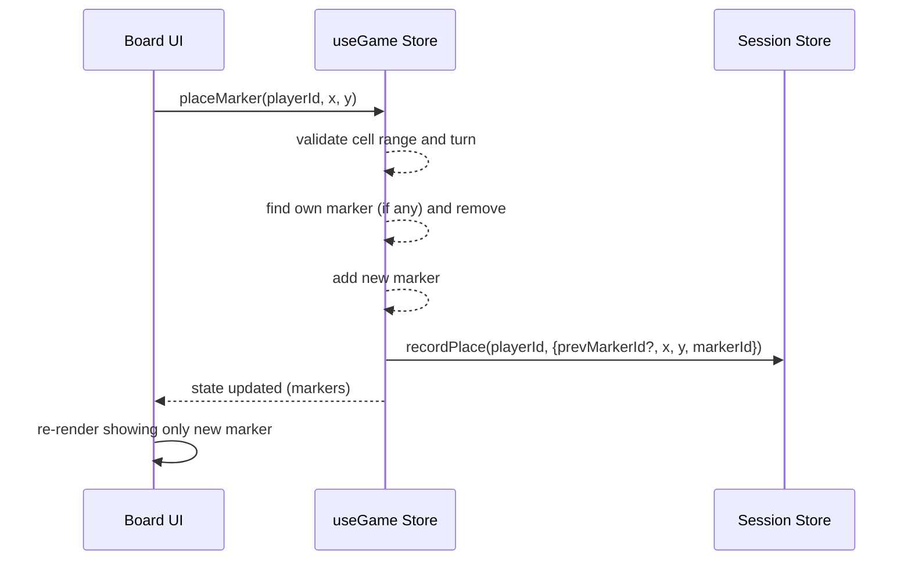

## 概要

この設計は、プレイヤーが新しいタイムマーカーを置いたときに既存のマーカーを削除して「移動」として扱う挙動を導入するための技術設計である。対象はフロントエンドの状態管理層（Zustand）中心で、UI の大幅な変更は不要とする。

### Goals

- 要件 1.1–1.3 を満たす: 同一プレイヤーの既存マーカーを置き換え、盤上にそのプレイヤーのマーカーは常に 1 つであることを保証する。
- 要件 2.1 を満たす: UI が移動を視覚的に反映する（描画 200ms 以内）こと。
- 要件 3.1–3.2 を満たす: ターン/無効セル判定や並列操作競合の防止を確保する。

### Non-Goals

- サーバー側永続化や外部 API 連携の追加は本設計の範囲外。

## 要件トレーサビリティ

| Requirement | Summary                                    | Components              | Interfaces            | Flows                |
| ----------- | ------------------------------------------ | ----------------------- | --------------------- | -------------------- |
| 1.1         | 既存マーカーを削除して新しいマーカーを配置 | useGame.placeMarker     | Internal state update | sequence: UI → Store |
| 1.2         | 新規配置の振る舞い                         | useGame.placeMarker     | Internal state update | sequence             |
| 1.3         | 盤上に重複が残らないこと                   | useGame.placeMarker     | Internal state update | sequence             |
| 2.1         | UI の即時更新（200ms）                     | Board.tsx, React render | state subscription    | UI render path       |
| 3.1         | ターン/無効セルの拒否                      | useGame.placeMarker     | validation checks     | sequence             |
| 3.2         | 並列競合の防止                             | useGame.placeMarker     | atomic update         | sequence             |

## アーキテクチャ

### Existing Architecture Analysis

- 既存コードはフロントエンド単体で動作し、状態は `Zustand` により保持されている。`Board.tsx` が `placeMarker` を呼び出し、`markers` 配列に基づいてレンダリングを行う。

### Architecture Pattern & Boundary Map

- Selected pattern: Store-centric domain rule enforcement（ドメイン不変条件を状態層に置く）
- Domain boundaries: UI（表示） ↔ Store（ドメイン不変条件・状態遷移）
- 新規コンポーネント: なし。既存 Store のメソッド修正で対応。



## Technology Stack & Alignment

| Layer    | Choice / Version   | Role in Feature             | Notes                                  |
| -------- | ------------------ | --------------------------- | -------------------------------------- |
| Frontend | React + TypeScript | UI rendering                | Existing project stack                 |
| State    | Zustand            | Domain state and invariants | `placeMarker` を修正する主な場所       |
| Models   | TypeScript types   | `TimeMarker` 型             | 既存 `src/models/timeMarker.ts` を使用 |

## コンポーネント & インターフェース

### useGame Store（変更対象）

| Field        | Detail                                                                                       |
| ------------ | -------------------------------------------------------------------------------------------- |
| Intent       | タイムマーカーの配置、移動、取得を一元管理し、プレイヤーごとの単一マーカー不変条件を担保する |
| Requirements | 1.1, 1.2, 1.3, 3.1, 3.2                                                                      |

Responsibilities & Constraints

- `placeMarker(playerId: string, x: number, y: number): boolean` を次のように振る舞わせる:
  - 前提条件チェック: 座標範囲、ターン、対象セルの可否を検証する。
  - 既存の同一プレイヤーマーカーが存在する場合はそのマーカーを削除する（state の更新は単一の set 呼び出しで行う）。
  - 新しいマーカーを作成して追加する。
  - セッション記録を更新する際、`prevMarkerId` を渡して移動であることを明示する。
  - 戻り値は操作成功を示す boolean とする（変更前と整合を取るための互換性を保つ）。

Dependencies

- Inbound: `Board.tsx` — UI がこのメソッドを呼び出す（P0）
- Outbound: `session` ストア — 配置履歴を記録（P1）

Contracts

- Service: `placeMarker(playerId: string, x: number, y: number): boolean`
  - Preconditions: `0 <= x < SIZE`, `0 <= y < SIZE`, `playerId` が現在のターンであること
  - Postconditions: 該当プレイヤーのマーカーは盤上にちょうど 1 つ存在し、`markers` が更新される

Implementation Notes

- Use Zustand の `set((s) => ...)` で単一の更新を行い、並列性の観点から可能な限り同期的に状態を置き換える。
- `recordPlace` 呼び出しは移動の場合 `prevMarkerId` を含める（追跡性確保）。

### 設計決定: インプレース移動（マーカー ID を維持して座標を更新）

**決定**: マーカーを移動する際は内部的に新しいオブジェクトを毎回生成せず、既存の `TimeMarker.id` を保持したまま `x`, `y`, `placedAt` を更新するインプレース（in-place）方式を採用する。

**理由**:

- UI やセッション履歴で「同じ物が移動した」という表現が直感的になる。
- 参照整合性が保ちやすく、undo/redo やアニメーション、差分比較が容易。
- 実装は `useGame` 側の更新だけで済み、侵襲が小さい。

**実装スケッチ**:

```ts
// placeMarker 内の移動処理（概略）
const ownIndex = get().markers.findIndex((m) => m.playerId === playerId);
if (ownIndex >= 0) {
  set((s) => {
    const next = s.markers.slice();
    const prev = next[ownIndex];
    next[ownIndex] = { ...prev, x, y, placedAt: new Date().toISOString() };
    return { markers: next };
  });
  // recordPlace に prevPosition を渡す（後方互換の optional フィールド）
  useSession.getState().recordPlace(playerId, {
    markerId: get().markers[ownIndex].id,
    prevPosition: {
      x: get().markers[ownIndex].x,
      y: get().markers[ownIndex].y,
    },
    x,
    y,
    moved: true,
  });
  return true;
}
```

**`recordPlace` の後方互換的拡張**:

- 既存呼び出しを壊さないため、`recordPlace` の第 2 引数に以下の optional フィールドを追加することを推奨します。
  - `prevPosition?: { x: number; y: number }` — 移動元の座標
  - `moved?: boolean` — 配置が移動（true）か新規（false/undefined）かのフラグ

この拡張により、移動時は `markerId` を保持して履歴に移動として記録でき、既存の記録処理はそのまま動作します。

## データモデル

既存の `TimeMarker` 型を拡張する必要はなく、`id`, `playerId`, `x`, `y`, `placedAt` を引き続き使用する。

## エラー処理

- 無効な座標 / 相手のターン / セル占有時は `placeMarker` は `false` を返し、状態を変更しない（1.1 / 3.1 に準拠）。
- 移動中の例外はログに記録し、UI には汎用のエラー表示（再試行案内）を出す。詳細は `research.md` を参照。

## テスト戦略

- Unit: `placeMarker` の以下ケースを網羅する。
  - 新規配置（既存マーカー無し） -> 成功、markers に 1 つ追加
  - 置換（既存マーカー有り） -> 成功、旧マーカーは削除され新マーカーが追加
  - 無効操作（範囲外 / 相手ターン / セル占有） -> 失敗、markers は変更なし
- Concurrency: 同一プレイヤーで 2 回同時に `placeMarker` を呼ぶシミュレーション → 最終状態の整合性検証
- Integration/UI: `Board` の E2E で描画が 200ms 以内に更新されることを検証

## <!-- Open Questions and Risks resolved and removed -->
