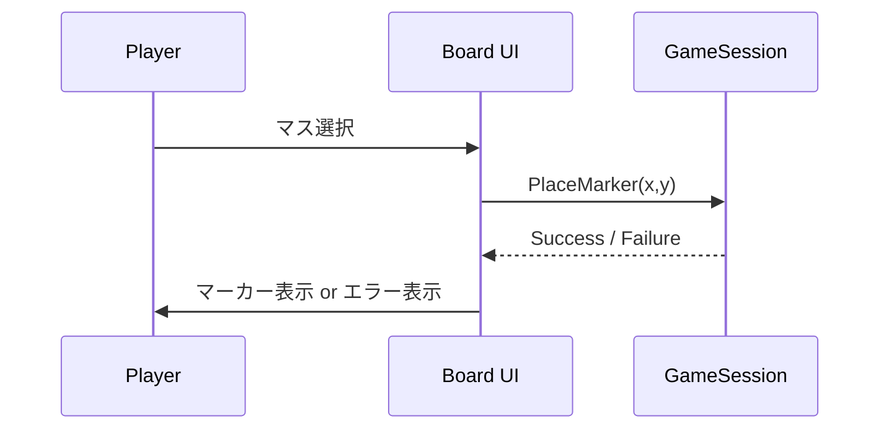

 # Design: time-marker-placement

## Overview
この設計は、PatchDuel の最小実装として「プレイヤーが 8×8 の盤上にタイムマーカーを配置し、ターンを終了できる」機能を実装するための設計指針を示す。ターゲットはローカル単一プレイヤーの UI 実装で、拡張性を保ちながらもシンプルに実装できることを重視する。

### Goals
- プレイヤーが盤上の任意の空きマスにタイムマーカーを配置できること。
- プレイヤーがタイムマーカー未配置でもターンを終了できること。
- 盤は 8×8 を明示的に表現し、重複配置や盤外選択を防止すること。

### Non-Goals
- ネットワーク対戦や複雑なターン解決ルールの実装（将来の拡張として扱う）。
- 永続ストレージ／データベース設計（セッションはメモリ内の最小実装）。

## Architecture
シンプルなフロントエンド中心の構成を想定する（単一ページアプリケーション）。主要コンポーネントは UI（Board）、ゲーム状態管理（GameSession）、ドメインモデル（TimeMarker）で、いずれもローカルで完結する。

### Technology Stack (提案)
| Layer | Choice | Role |
|---|---|---|
| Frontend | HTML/JS/簡易フレームワーク（例: React/Vue） | 盤表示とユーザー操作 |
| State | in-memory store (component state / simple store) | セッション状態管理 |

## System Flows

### 配置フロー（Place Marker）


決定事項:
- PlaceMarker は座標検証（範囲内、空きマス）を行う。
- 重複時は配置失敗を返し、UI は適切なフィードバック（非ブロッカー）を表示する。

### ターン終了フロー（End Turn）
- プレイヤーが「ターン終了」を実行すると `GameSession.endTurn()` を呼び出し、セッション状態を `ended` に更新する（最小実装では次プレイヤー遷移は行わない）。

## Components and Interfaces

### Board (UI)
| Field | Detail |
|---|---|
| Intent | 8×8 の盤を描画し、マス選択イベントを発火する|
| Requirements | 1, 3 |

Contract:
```typescript
interface BoardProps {
  markers: TimeMarker[];
  onSelect(x:number,y:number): void;
}
```

### GameSession (State Manager)
| Field | Detail |
|---|---|
| Intent | 現在の盤状態・プレイヤー状態を管理する|
| Requirements | 1,2,3,4 |

API:
```typescript
interface GameSession {
  placeMarker(playerId:string,x:number,y:number): Result<boolean,string>;
  endTurn(playerId:string): void;
  getBoard(): TimeMarker[];
}
```

実装ノート:
- `placeMarker` は座標の範囲チェックと重複チェックを行う。
- `endTurn` はマーカー未配置でも許容する（受け付けてターンを終了）。ログや UI の状態更新を行う。

## Data Models

### TimeMarker
| Field | Type | Note |
|---|---:|---|
| id | string | 一意識別子 |
| playerId | string | 所有者 |
| x | number | 0..7 |
| y | number | 0..7 |
| placedAt | ISO8601 | 記録用 |

インバリアント:
- x, y は 0 〜 7 の範囲。
- 同一 (x,y) に複数のマーカーは存在しない。

## Requirements Traceability
| Requirement | Design Element |
|---|---|
| Requirement 1 (Placement) | `Board`, `GameSession.placeMarker`, `TimeMarker` model |
| Requirement 2 (End Turn) | `GameSession.endTurn`, UI のターン終了ボタン |
| Requirement 3 (Board Representation) | `Board` の固定 8×8 レイアウト、選択ハイライト |
| Requirement 4 (Session) | `GameSession` 初期化ロジック |

## Error Handling
- 無効マス選択（盤外）: `placeMarker` が失敗を返し UI は選択を無効化。
- 重複配置: `placeMarker` が `409` 相当のエラーを返す。UI は分かりやすいメッセージを表示。

## Testing Strategy
- Unit: `placeMarker` の範囲チェック、重複チェック、`endTurn` の状態遷移。
- Integration: Board UI と GameSession の連携（マーカーが描画されること）。
- E2E: ユーザーパス — マーカー配置 → ターン終了（マーカー未配置での終了含む）。

## Supporting References
- 要件は `.kiro/specs/time-marker-placement/requirements.md` に記載。

---
設計は最小実装を前提としているため、将来的なマルチプレイヤーや保存機能は別タスクで扱う。
